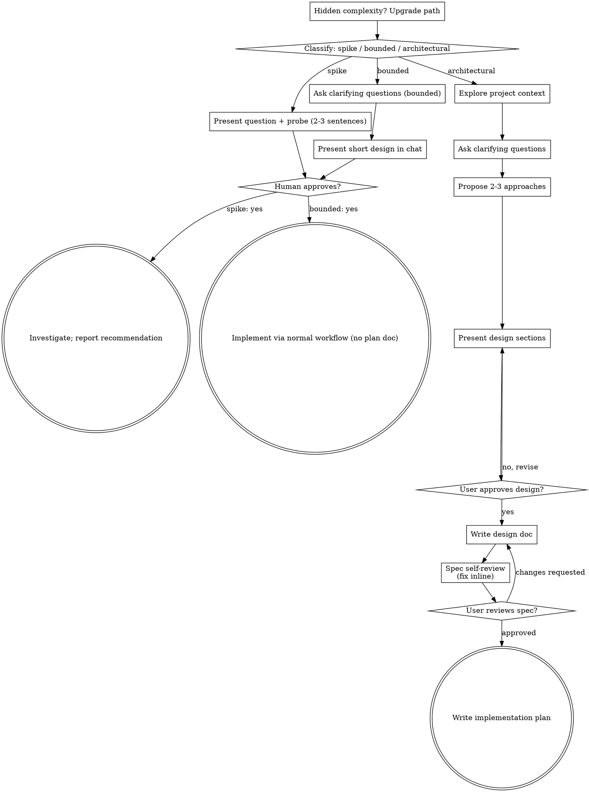

# Brainstorming Ideas Into Designs

Help turn ideas into fully formed designs and specs through natural collaborative dialogue.

Start by classifying how much process the request needs, then work
through your path: understand the context, refine the idea, present a
design, and get your human partner's approval.

<HARD-GATE>
Do NOT invoke any implementation skill, write any code, scaffold any
project, or take any implementation action until you have told your
human partner what you intend and they have approved it. This applies
to EVERY task on EVERY path below — the ceremony scales with the task;
the approval gate never does.
</HARD-GATE>

## When to use

Use this before any creative work: new features, new components, new behavior, or a change that needs a design. Do not use it to implement an already-approved design, to write code the partner already agreed to, or to produce a spec when they only asked a yes/no question.

## Intake — before you classify

Before you classify the path, check that you have enough to classify. You need:

1. A request that names an object of work (a feature, a change, a feasibility question, or a system to design). "Build something cool" or a bare "let's brainstorm" is not enough.
2. For anything you might call **bounded**: the repo, and a flow that already exists in it to read. Familiarity with this kind of app is not a substitute.
3. A human partner who can approve. If you cannot reach them, you cannot pass the gate later — do not start as if you can.

If any of those is missing, stop. Say what is missing and what you need. Do not invent a product, a scope, or a path to keep the conversation moving.

## HOLD — stop and return this, not a design

When you cannot proceed, return the gap. Do not fill it with a polished design.

| Condition | What is missing | What it needs | Return instead of a design |
|---|---|---|---|
| No object of work | A named idea, change, or question | One sentence from the partner naming what to design or probe | "I need the object of work: a feature, a change, or a feasibility question. I will not invent one." |
| Bounded claimed, no existing flow | A flow in this repo to change | A path or file that already implements the flow, or a reclassification to architectural | "This is not bounded — there is no existing flow to change. I am holding at classification." |
| Repo unreadable and you would call it bounded | Project context | Access to files, docs, or commits, or an explicit architectural path | "I cannot read the repo, so I cannot call this bounded. Holding." |
| Classification not yet said aloud | A stated path the partner can override | You saying spike / bounded / architectural in chat | Say the classification. Wait if they might override. |
| Approval not given | An explicit yes to the probe, the short design, or the spec | A nod (spike) or an explicit yes (bounded / architectural) | The probe, the short design, or the spec — then stop. Do not implement. |
| Hidden complexity mid-task | A current path that still fits | A one-way upgrade, said aloud, and a new approval | Stop. Say the path is upgrading. Do not finish on the old path. |
| Spec still has TBD, contradictions, or two readings | A spec that can be implemented as written | Inline fixes, then partner review | Hold the plan handoff. Fix or ask. |
| Visual companion not accepted | Consent to open the browser tool | A yes to the offer, as its own message | Stay text-only. Do not start the server. |

A HOLD is a return value, not a delay before you guess.

## Defaults: cut first

This operation defaults to less, not more.

- Do not write a spec file on spike or bounded. Chat is the artifact.
- Do not keep spike code. Label it throwaway. Keeping it is a new request.
- Do not offer the visual companion until a real visual question exists. If none arises, never offer it.
- Do not propose unrelated refactor. Stay on the current goal.
- Do not add features the request did not ask for. Extra scope needs evidence from the partner or the repo.
- Do not invoke any implementation skill before approval. On the architectural path after spec approval, write the implementation plan using the plan method in this file. Do not start coding from the spec.
- Do not start implementation in the same breath as presenting a design.
- A second approach, extra section, or extra document needs a reason from the request or the repo — not from a habit of completeness.
- When two paths are honestly in doubt, take the heavier one. That is a safety upgrade, not a license to add artifacts the heavier path does not require.

## Will not produce

Do not return any of the following:

- Code, scaffolding, or an implementation-skill invocation before the partner approves
- A spec file for spike or bounded work
- Spike code treated as keepable
- A short "bounded" design for a flow you have not read, or for a new project
- Unrelated refactor plans
- Feature lists padded so the design looks complete
- A visual-companion offer as the first message, or bundled with a question
- A spec handed over with TBD, TODO, placeholders, or two readings of the same requirement
- A plan with TBD, TODO, "similar to Task N", or steps that describe without showing
- A stall because visual-companion.md, writing-plans, or a style skill is missing
- "Starting while they read the design"
- A follow-up implementation treated as approved because the spike was approved

## Before you return

Run this check on the output. If any item fails, fix or HOLD — do not hand it over.

- Classification was said aloud before the first question
- Bounded was used only when an existing flow was read
- You have not implemented, scaffolded, or invoked an implementation skill
- Spike output is a recommendation; anything built is labeled throwaway
- Bounded output is a short in-chat design, then a stop for yes
- Architectural spec has no TBD/TODO, no internal contradictions, one reading per requirement
- Architectural plan (if due) has a file map, no placeholders, and a task for every spec requirement
- You did not stall because a companion file was missing
- Approval is still closed if they have not said yes
- You did not offer the visual companion except as its own message, and only for a visual question

## What this process changes

The recipe is not a neutral mirror. It changes the work:

- Three buckets (spike / bounded / architectural) flatten mixed work into one path. A request that is half probe and half product will be forced into one.
- Saying the classification aloud is not a neutral label. It is a recommendation. Many partners will not override. That shrinks the set of designs they consider, including ones they would have named if you had stayed silent.
- One question per message changes which constraints surface, and in what order, compared with a single design dump.
- Cutting unused features will drop items they mentioned in passing if you treat passing mentions as optional.
- Writing the spec makes the spec the object. Writing the plan from this file does the same for the plan. Later work follows those files, including any framing you chose, even when no companion skill is present.
- The visual companion pulls the conversation into mockups and spends tokens. Offering it changes what gets discussed.
- The one-way ratchet (never downgrade mid-task) over-weights heaviness once any hidden complexity is seen.

What still needs a human, and cannot be supplied by this recipe: whether to override the path you named, the approval, whether spike findings become a new request, whether a "simple" change is actually the work they want, and whether the plan's file map is the decomposition they want.

## Method card — same family every run

A later agent runs this from this file alone. Companion files (visual-companion.md, a writing-plans skill, an elements-of-style skill) are optional extras. If they are missing, do not stall — use the methods below.

1. **Intake.** Object of work; for anything you might call bounded, a readable existing flow; an approving partner. Any missing → HOLD.
2. **Classify aloud** before the first question: spike / bounded / architectural. Partner may override.
3. **Ratchet (one-way).** When two paths are honestly in doubt, take the heavier. Hidden complexity mid-task upgrades the path — stop, say so, get a new approval. Nothing downgrades mid-task.
4. **Path work.** Spike: probe + nod + cheap investigate + recommendation. Bounded: read the flow, questions, short in-chat design, stop for yes. Architectural: questions, 2–3 approaches, sectioned design, written spec, partner review, then the plan.
5. **Approval gate.** Present intent, then stop. Never implement, scaffold, or invoke an implementation skill in the same breath.
6. **Visual companion (optional tool).** Offer only on a real visual question, as its own message. After yes, run the companion loop in this file. Per-question see-vs-read test. Decline or no visual question → stay text-only.
7. **Spec prose (architectural).** Write the spec with the prose rules in this file. Self-review. Partner reviews the file.
8. **Plan (architectural, after spec yes).** Write the implementation plan with the plan method in this file. Stop. Do not code.

## Three Paths

Before your first question, classify the request and say the
classification out loud — "this looks bounded, so I'll present a short
design here rather than write a spec" — so your human partner can
override it:

- **Spike** — a feasibility question ("can we...", "is it possible...",
  "quick and dirty is fine") whose output is an answer, not code you
  keep. Present the question and what you'll try in 2-3 sentences, get
  a nod, then find out as cheaply as correctness allows. No design
  doc, no spec file. Report findings as a recommendation; anything you
  built stays labeled throwaway.
- **Bounded** — a well-scoped change to code that already exists in
  this repo: a new flag, a small endpoint, a one-file fix.
  Understanding the kind of app is not enough — bounded means the flow
  you are changing is already here to read. If there is no existing
  flow to change, the task is not bounded. Ask the clarifying
  questions that matter, present a short design IN CHAT (a few
  sentences to a few short paragraphs), and STOP. Implementation
  starts only after your human partner says yes to that design — a
  bounded task's approval is as hard a gate as an architectural
  one. No spec file, no implementation plan document.
- **Architectural** — new projects, new subsystems, changes that
  restructure how components fit together or alter interfaces others
  depend on. Follow the full process: questions, approaches, sectioned
  design, written spec, then the implementation plan (method below).

When in doubt between two paths, take the heavier one. The ratchet is
one-way: hidden complexity discovered mid-task upgrades the path —
stop, say so, and step up. Nothing downgrades mid-task.

## Anti-Pattern: "Too Simple To Need Approval"

Every path ends with your human partner approving your intent before
implementation. A todo list, a single-function utility, a config
change — the design may be two sentences in chat, but you MUST present
it and get approval. "Simple" tasks are where unexamined assumptions
cause the most wasted work. What scales with simplicity is the
artifact, never the approval.

## Red Flags

| Thought | Reality |
|---------|---------|
| "This is too simple to need a design" | Simple means a short design, not no design. Two sentences in chat, then approval. |
| "I'll call it bounded and skip the spec" | Reaching for a label to skip work IS the doubt — take the heavier path. |
| "It's bounded and the design is obvious — I'll start while they read it" | The gate is the approval, not the design's length. Present, then stop until you hear yes. |
| "I understand this kind of app, so it's bounded" | Bounded measures the repo, not your familiarity. A new project has no existing flow — it is architectural. |
| "The spike works, so I'll keep the code" | A spike's output is an answer. Keeping the code is a new request — classify it. |
| "It grew, but I'm almost done — no need to re-classify" | Hidden complexity upgrades the path mid-task. Stop and say so. |
| "They approved the spike, so the follow-up change is approved too" | Each task gets its own classification and its own approval. |

## Checklist

Classify first, announce the path, then create a task for each item on
your path and complete them in order.

**Spike:**
1. **Explore project context** — enough to frame the probe
2. **Present question + probe plan** — 2-3 sentences
3. **Get approval** — a nod is enough
4. **Investigate** — as cheaply as correctness allows
5. **Report findings** — a recommendation; label anything built as throwaway

**Bounded:**
1. **Explore project context** — check files, docs, recent commits
2. **Ask clarifying questions** — one at a time, the ones that matter
3. **Present short design in chat** — approach, files touched, testing
4. **Get approval** — STOP and wait for an explicit yes; presenting the design and starting in the same breath is skipping the gate
5. **Implement** — proceed with the normal development workflow (TDD applies); no plan document

**Architectural:**
1. **Explore project context** — check files, docs, recent commits
2. **Offer the visual companion just-in-time** — NOT upfront. The first time a question would genuinely be clearer shown than described, offer it then (its own message); on approval its browser tab opens for you. If no visual question ever arises, never offer it. See the Visual Companion section below.
3. **Ask clarifying questions** — one at a time, understand purpose/constraints/success criteria
4. **Propose 2-3 approaches** — with trade-offs and your recommendation
5. **Present design** — in sections scaled to their complexity, get user approval after each section
6. **Write design doc** — save to `docs/superpowers/specs/YYYY-MM-DD-<topic>-design.md` and commit
7. **Spec self-review** — quick inline check for placeholders, contradictions, ambiguity, scope (see below)
8. **User reviews written spec** — ask user to review the spec file before proceeding
9. **Write the implementation plan** — using the plan method in this file. Do not start coding.

## Process Flow

**Terminal states are path-bound.** Architectural: write the
implementation plan (method below), then stop — never frontend-design,
mcp-builder, or any other implementation skill. Bounded: after
approval, implementation proceeds directly through the normal
development workflow; no plan document. Spike: the terminal state is a
reported recommendation.

## The Process

The subsections below serve the bounded and architectural paths (a
spike stops at "present the probe, get a nod"). Sections from
**Exploring approaches** onward are architectural-path depth — for
bounded work, context plus a few questions plus a short in-chat design
is the whole process.

**Understanding the idea:**

- Check out the current project state first (files, docs, recent commits)
- Before asking detailed questions, assess scope: if the request describes multiple independent subsystems (e.g., "build a platform with chat, file storage, billing, and analytics"), flag this immediately. Don't spend questions refining details of a project that needs to be decomposed first.
- If the project is too large for a single spec, help the user decompose into sub-projects: what are the independent pieces, how do they relate, what order should they be built? Then brainstorm the first sub-project through the normal design flow. Each sub-project gets its own spec → plan → implementation cycle.
- For appropriately-scoped projects, ask questions one at a time to refine the idea
- Prefer multiple choice questions when possible, but open-ended is fine too
- Only one question per message - if a topic needs more exploration, break it into multiple questions
- Focus on understanding: purpose, constraints, success criteria

**Exploring approaches:**

- Propose 2-3 different approaches with trade-offs
- Present options conversationally with your recommendation and reasoning
- Lead with your recommended option and explain why
- YAGNI ruthlessly - remove unnecessary features from every approach and design

**Presenting the design:**

- Once you believe you understand what you're building, present the design
- Scale each section to its complexity: a few sentences if straightforward, up to 200-300 words if nuanced
- Ask after each section whether it looks right so far
- Cover: architecture, components, data flow, error handling, testing
- Be ready to go back and clarify if something doesn't make sense

**Design for isolation and clarity:**

- Break the system into smaller units that each have one clear purpose, communicate through well-defined interfaces, and can be understood and tested independently
- For each unit, you should be able to answer: what does it do, how do you use it, and what does it depend on?
- Can someone understand what a unit does without reading its internals? Can you change the internals without breaking consumers? If not, the boundaries need work.
- Smaller, well-bounded units are also easier for you to work with - you reason better about code you can hold in context at once, and your edits are more reliable when files are focused. When a file grows large, that's often a signal that it's doing too much.

**Working in existing codebases:**

- Explore the current structure before proposing changes. Follow existing patterns.
- Where existing code has problems that affect the work (e.g., a file that's grown too large, unclear boundaries, tangled responsibilities), include targeted improvements as part of the design - the way a good developer improves code they're working in.
- Don't propose unrelated refactoring. Stay focused on what serves the current goal.

## After the Design (architectural path)

**Documentation:**

- Write the validated design (spec) to `docs/superpowers/specs/YYYY-MM-DD-<topic>-design.md`
  - (User preferences for spec location override this default)
- Apply the spec prose rules below while writing. Do not wait on an external style skill.
- Commit the design document to git

**Spec Self-Review:**
After writing the spec document, look at it with fresh eyes:

1. **Placeholder scan:** Any "TBD", "TODO", incomplete sections, or vague requirements? Fix them.
2. **Internal consistency:** Do any sections contradict each other? Does the architecture match the feature descriptions?
3. **Scope check:** Is this focused enough for a single implementation plan, or does it need decomposition?
4. **Ambiguity check:** Could any requirement be interpreted two different ways? If so, pick one and make it explicit.

Fix any issues inline. No need to re-review — just fix and move on.

**User Review Gate:**
After the spec review loop passes, ask the user to review the written spec before proceeding:

> "Spec written and committed to `<path>`. Please review it and let me know if you want to make any changes before we start writing out the implementation plan."

Wait for the user's response. If they request changes, make them and re-run the spec review loop. Only proceed once the user approves.

**Implementation plan (after spec approval):**

Write the plan yourself using the plan method below. If a writing-plans
skill happens to be on disk you may follow it; if it is missing, this
section is enough. Do not invoke frontend-design, mcp-builder, or any
other implementation skill. Do not start coding.

## Spec prose

The spec is read by a later agent and by your human partner. Write it
so one reading is the only reading.

- Active voice. Name the actor.
- Positive form: say what the system does, not what it does not do, unless the refusal is the requirement.
- Definite, specific, concrete: file paths, counts, interface names, exact constraints. No "the usual", "appropriate", "as needed".
- Omit needless words. If a sentence restates the last one, cut it.
- Keep related words together. Subject next to verb; modifier next to the thing it modifies.
- Place the emphatic word at the end of the sentence.
- One topic per paragraph; first sentence states the topic.
- Coordinate ideas in the same form (parallel lists, parallel headings).
- Prefer the word the partner used for the object of work. Do not rebrand it.

These rules do not replace the spec self-review. They are how you write
the sentences the self-review will read.

## Plan method

The plan is for an engineer with no project context. It must be
executable without you in the room.

1. **Scope check.** One plan per independent subsystem. If the spec
   covers two, split and say so. Each plan must produce working,
   testable software on its own.
2. **File map first.** Before tasks, list files to create or modify
   and what each is responsible for. One clear purpose per file;
   communicate through named interfaces. Split by responsibility, not
   by layer. Follow existing patterns; include a split only when a
   file you are already touching has grown unwieldy.
3. **Save to** `docs/superpowers/plans/YYYY-MM-DD-<feature-name>.md`
   (user preference overrides the path). Header required: Goal (one
   sentence), Architecture (2–3 sentences), Tech stack, Spec path
   (the spec travels with the plan), Global constraints copied
   verbatim from the spec (versions, naming, platform).
4. **Task right-size.** A task is the smallest unit with its own test
   cycle that a reviewer could reject without rejecting its neighbor.
   Fold setup and docs into the task that needs them.
5. **Each task** lists Files (create / modify with path, test path),
   Interfaces (Consumes / Produces — exact names and types; a task
   implementer sees only their own task), then bite-sized steps:
   write the failing test (actual code), run it (expected FAIL),
   write the minimal implementation (actual code), run it (expected
   PASS), commit. One action per step, 2–5 minutes.
6. **No placeholders.** These are plan failures — never write them:
   TBD, TODO, "implement later", "add appropriate error handling",
   "write tests for the above" without the test, "similar to Task N",
   steps that describe what to do without showing how, or references
   to types/functions not defined in any task. Repeat the code; the
   engineer may read tasks out of order.
7. **Self-review** against the spec: every requirement has a task;
   no placeholder patterns; names and types match across tasks. Fix
   inline. If a requirement has no task, add the task.
8. **Handoff.** Save the plan, tell the partner the path, offer
   execution choice (fresh subagent per task with review between, or
   inline in this session with checkpoints). Wait. Do not start
   coding until they choose.

## Visual Companion

The method is see-versus-read, decided per question: show only when seeing would change the answer; otherwise write. The loop below is how you show. It is not why you show. Available as a tool — not a mode. Accepting the companion means it's available for questions that benefit from visual treatment; it does NOT mean every question goes through the browser.

**Offering the companion (just-in-time):** Do NOT offer it upfront. Wait until a question would genuinely be clearer shown than told — a real mockup / layout / diagram question, not merely a UI *topic*. The first time that happens, offer it then, as its own message:
> "This next part might be easier if I show you — I can put together mockups, diagrams, and comparisons in a browser tab as we go. It's still new and can be token-intensive. Want me to? I'll open it for you."

**This offer MUST be its own message.** Only the offer — no clarifying question, summary, or other content. Wait for the user's response. If they accept, start the server with `--open` so their browser opens to the first screen automatically. If they decline, continue text-only and don't offer again unless they raise it.

**Per-question decision:** Even after the user accepts, decide FOR EACH QUESTION whether to use the browser or the terminal. The test: **would the user understand this better by seeing it than reading it?**

- **Use the browser** for content that IS visual — mockups, wireframes, layout comparisons, architecture diagrams, side-by-side visual designs
- **Use the terminal** for content that is text — requirements questions, conceptual choices, tradeoff lists, A/B/C/D text options, scope decisions

A question about a UI topic is not automatically a visual question. "What does personality mean in this context?" is a conceptual question — use the terminal. "Which wizard layout works better?" is a visual question — use the browser.

If they decline, or if no visual question arises, stay text-only. Do
not open the companion file; you do not need it.

**Companion loop (after they accept):**

1. Start `scripts/start-server.sh --project-dir <project-root> --open`.
   Save `screen_dir`, `state_dir`, and the complete `url` (keep the
   `?key=` query; never hand out a bare host:port). Pass the project
   root so mockups persist under `.superpowers/brainstorm/`. Remind
   them to gitignore `.superpowers/` if it is not already ignored.
   The server must stay up across turns; if your environment reaps
   detached processes, launch it in the foreground via the platform
   background mechanism. If the URL is unreachable from their
   browser, bind `--host 0.0.0.0` and set `--url-host` to what they
   can open.
2. Before every screen: confirm the server is alive (`$STATE_DIR/server-info`
   exists and `$STATE_DIR/server-stopped` does not). If it has
   exited, restart with the same `--project-dir` — same port, their
   tab reconnects. Do not send a new URL unless the port changed.
3. Write an HTML **fragment** (no `<!DOCTYPE`, no `<html>`) to a
   **new** semantic filename in `screen_dir` (`layout.html`,
   `layout-v2.html`). Never reuse a filename. Never write the file
   with cat/heredoc (noise in the terminal). The server wraps
   fragments and serves the newest file. Full documents only when
   you need complete page control.
4. Tell them the URL every step, plus one line on what is on
   screen. Ask them to answer in the terminal. End your turn.
5. Next turn: read `$STATE_DIR/events` if it exists (JSON lines:
   `{type, choice, text, timestamp}`). Terminal text is primary;
   events are structured clicks. The last `choice` is usually the
   selection; a click path can show hesitation worth asking about.
   If `events` is missing, use terminal text only.
6. If feedback changes this screen, write a new versioned file.
   Advance only when the current step is validated. Two to four
   options per screen. Scale fidelity to the question (wireframe
   for layout, polish for look). State the question on the page.
   Prefer real content when placeholder content would hide a
   design issue.
7. When the next step is text, push a waiting fragment so they are
   not staring at a resolved choice:
   `

Continuing in terminal...

`
8. Frame classes you may use without writing CSS: `options` /
   `option` / `letter` / `content` (add `data-multiselect` on the
   container for multi-select), `cards` / `card` / `card-image` /
   `card-body`, `mockup` / `mockup-header` / `mockup-body`,
   `split`, `pros-cons`, `mock-nav`, `mock-sidebar`, `mock-content`,
   `mock-button`, `mock-input`, `placeholder`, `subtitle`,
   `section`, `label`. Clickable choices need `data-choice` and
   `onclick="toggleSelect(this)"`.
9. Stop with `scripts/stop-server.sh $SESSION_DIR` when the visual
   work is done. Project-dir mockups persist; `/tmp` sessions do not.

The companion is a tool for questions that are visual. It is not a
mode, and it is not required to finish this recipe.
