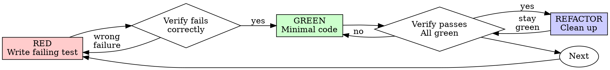

# Test-Driven Development (TDD)

## Overview

Write the test first. Watch it fail. Write minimal code to pass.

**Core principle:** If you didn't watch the test fail, you don't know if it tests the right thing.

**Violating the letter of the rules is violating the spirit of the rules.**

## When to Use

**Always:**
- New features
- Bug fixes
- Refactoring
- Behavior changes

**Exceptions (ask your human partner):**
- Throwaway prototypes
- Generated code
- Configuration files

Thinking "skip TDD just this once"? Stop. That's rationalization.

**Do not use this to:**
- Write tests after the production code already exists (that is verification, not TDD)
- Keep a green suite that encodes the wrong object
- Add coverage for its own sake
- Explore a design you intend to throw away (spike first, then start over with TDD)
- Produce a test plan, a coverage report, or a testing strategy document

## Intake — before RED

You need three things. Nothing else starts. Do not write a test. Do not write production code.

1. **A named required behavior.** What should the system do, for whom, after this change? "Add tests," "make it work," or "cover this file" is not enough.
2. **A way to tell the object is wrong.** A concrete failure a user would see, or a production change that would be a bug if it shipped. If you cannot name what would be wrong if we shipped without this, you do not have a requirement.
3. **A surface you can exercise.** Code, an API, or a behavior you can call from a test. A requirement with no observable surface is not a TDD object yet.

If any of those is missing, stop. Say what is missing and what you need. Do not invent a test to keep moving. Do not write production code "so we have something to test."

The test is not the intake. The requirement is. A failing test written against a guessed requirement is generation, not observation.

## HOLD — stop and return this, not a green suite

When you cannot proceed, return the gap. Do not fill it with a passing test or a stub that makes a guessed test green.

| Condition | What is missing | What it needs | Return instead of a green suite |
|---|---|---|---|
| No named required behavior | The object of the change | What the system should do, for whom, after this change | "I need the required behavior, not a test idea. I will not invent one." |
| Cannot say what would be wrong if we shipped without it | A failure the user would see | A concrete wrong outcome, or a production change that would be a bug | "If I cannot name the wrong outcome, I do not have a requirement. Holding." |
| No observable surface | Something a test can call | Code, API, or behavior you can exercise | "No surface to exercise. I will not write a test against a guess." |
| Test would encode a guessed requirement | Confirmation the requirement is the right object | Human yes on the named behavior | The named behavior and the question. No test. No production code. |
| Green suite would pass and the required behavior would still be missing or inverted | A test whose green state is the required object | Rewrite the test against the requirement, or HOLD | "A green suite can be the wrong object. I will not keep these tests." |
| Code already written, no failing test first | A deleted implementation | Delete, then RED | Delete the code. Do not "adapt" it. |
| Test passes immediately | A test of missing behavior | Fix the test until it fails for the right reason | The unexpected pass and why. No production change. |
| Test errors instead of failing | A correct failure | Fix the error, re-run until it fails because the feature is missing | The error. No GREEN. |
| Exception surface (prototype, generated, config) without a human yes | Authority to skip | Explicit yes from the partner | The exception and the question. No skip on your own. |
| Companion `writing-good-tests.md` missing | Nothing — that file is optional | The method already in this file | Do not stall. Use the method card below. |

A HOLD is a return value, not a delay before you write the test anyway.

## Defaults: cut first

This operation defaults to less, not more.

- No production code without a failing test first. Write code before the test? Delete it. Start over.
- Do not keep untested code as "reference." Do not "adapt" it while writing tests. Delete means delete.
- Do not add a feature, option, or helper the current test does not require.
- Do not refactor other code in GREEN. GREEN is the smallest change that makes this test pass.
- Do not add a second test until this one has gone RED for the right reason, then GREEN, then (if needed) REFACTOR.
- Prefer one behavior per test. "And" in the name means split, not expand.
- Prefer a real dependency over a mock. A mock is allowed only when the real one is slow or external and you have already named why.
- Extra files, extra fixtures, or a new test harness need a reason from the requirement — not from a habit of completeness.
- If `writing-good-tests.md` is missing, do not create it. Use the method card in this file.

## Will not produce

Do not return any of the following:

- Production code written before a failing test
- A test written after the implementation
- A test that passed on the first run, presented as proof
- A green suite that encodes a guessed or inverted requirement
- A stub that makes the assertion pass without the real behavior
- Code kept from a pre-test implementation "as reference"
- Mocks of the code under test
- Coverage for its own sake
- A skip, a deleted assertion, or "I'll verify manually"
- A stall because `writing-good-tests.md` is missing
- An exception (prototype, generated, config) taken without a human yes

## Method card — same family every run

A later agent runs this from this file alone. `writing-good-tests.md` is an optional extra. If it is missing, do not stall and do not invent a different method — use the card below. Do not skip, reorder, or replace these steps.

1. **Intake.** Named required behavior + a way to tell the object is wrong + a surface you can exercise. Any gap → HOLD.
2. **Confirm the object.** Say the required behavior out loud. If the partner has not confirmed it and you would have to guess, HOLD. The test is not allowed to invent the object.
3. **RED.** Write one minimal test of that required behavior. Name the production change that would make it fail. Watch it fail for the right reason (feature missing, not a typo).
4. **GREEN.** Write the smallest production code that makes this test pass. Nothing else.
5. **REFACTOR.** After green only. Remove duplication, improve names. Do not add behavior. Stay green.
6. **Return.** Required behavior stated, a test that failed then passed for that behavior, minimal code — or a HOLD. Nothing else.

Before marking work complete, the output must survive this test: if the required behavior were inverted or missing, would this suite go red? If no, the suite is the wrong object. HOLD or rewrite the test. Do not ship a green lie.

## The Iron Law

```
NO PRODUCTION CODE WITHOUT A FAILING TEST FIRST
```

Write code before the test? Delete it. Start over.

**No exceptions:**
- Don't keep it as "reference"
- Don't "adapt" it while writing tests
- Don't look at it
- Delete means delete

Implement fresh from tests. Period.

## Red-Green-Refactor



### RED - Write Failing Test

Write one minimal test showing what should happen.

<Good>
```typescript
test('retries failed operations 3 times', async () => {
  let attempts = 0;
  const operation = () => {
    attempts++;
    if (attempts < 3) throw new Error('fail');
    return 'success';
  };

  const result = await retryOperation(operation);

  expect(result).toBe('success');
  expect(attempts).toBe(3);
});
```
Clear name, tests real behavior, one thing
</Good>

<Bad>
```typescript
test('retry works', async () => {
  const mock = jest.fn()
    .mockRejectedValueOnce(new Error())
    .mockRejectedValueOnce(new Error())
    .mockResolvedValueOnce('success');
  await retryOperation(mock);
  expect(mock).toHaveBeenCalledTimes(3);
});
```
Vague name, tests mock not code
</Bad>

**Requirements:**
- One behavior
- Clear name
- Real code (no mocks unless unavoidable)

### Verify RED - Watch It Fail

**MANDATORY. Never skip.**

```bash
npm test path/to/test.test.ts
```

Confirm:
- Test fails (not errors)
- Failure message is expected
- Fails because feature missing (not typos)

**Test passes?** You're testing existing behavior. Fix test.

**Test errors?** Fix error, re-run until it fails correctly.

### GREEN - Minimal Code

Write simplest code to pass the test.

<Good>
```typescript
async function retryOperation<T>(fn: () => Promise<T>): Promise<T> {
  for (let i = 0; i < 3; i++) {
    try {
      return await fn();
    } catch (e) {
      if (i === 2) throw e;
    }
  }
  throw new Error('unreachable');
}
```
Just enough to pass
</Good>

<Bad>
```typescript
async function retryOperation<T>(
  fn: () => Promise<T>,
  options?: {
    maxRetries?: number;
    backoff?: 'linear' | 'exponential';
    onRetry?: (attempt: number) => void;
  }
): Promise<T> {
  // YAGNI
}
```
Over-engineered
</Bad>

Don't add features, refactor other code, or "improve" beyond the test.

### Verify GREEN - Watch It Pass

**MANDATORY.**

```bash
npm test path/to/test.test.ts
```

Confirm:
- Test passes
- Other tests still pass
- Output pristine (no errors, warnings)

**Test fails?** Fix code, not test.

**Other tests fail?** Fix now.

### REFACTOR - Clean Up

After green only:
- Remove duplication
- Improve names
- Extract helpers

Keep tests green. Don't add behavior.

### Repeat

Next failing test for next feature.

## Good Tests

| Quality | Good | Bad |
|---------|------|-----|
| **Minimal** | One thing. "and" in name? Split it. | `test('validates email and domain and whitespace')` |
| **Clear** | Name describes behavior | `test('test1')` |
| **Shows intent** | Demonstrates desired API | Obscures what code should do |

When writing or changing any test, read [writing-good-tests.md](writing-good-tests.md) for the rules that keep tests honest:
- Name the production change that would make the test fail — before writing it
- Assert on real behavior, never on mock behavior
- Keep test-only code in test utilities, out of production classes
- Understand a dependency's side effects before mocking it

## Common Rationalizations

| Excuse | Reality |
|--------|---------|
| "Too simple to test" | Simple code breaks. Test takes 30 seconds. |
| "I'll test after" | Tests written after pass immediately — which proves nothing. They may test the wrong thing, test the implementation instead of the behavior, or miss the edge case you forgot. You never watched it fail, so you never proved it can catch the bug. Test-first forces that failure. |
| "Tests after achieve same goals (spirit not ritual)" | Tests-after answer "what does this do?"; tests-first answer "what should this do?" Tests written after are biased by the code you already wrote — you verify the cases you remembered, not the ones you'd have discovered. Coverage without proof the tests work. |
| "Already manually tested" | Manual testing is ad-hoc: no record of what you covered, no way to re-run it when the code changes, easy to forget cases under pressure. "Worked when I tried it" ≠ comprehensive. Automated tests run the same way every time. |
| "Deleting X hours is wasteful" | Sunk cost fallacy — that time is already spent either way. The real choice: rewrite with TDD (high confidence) vs. keep it and bolt tests on after (low confidence, likely bugs). Keeping code you can't trust is the waste. |
| "Keep as reference, write tests first" | You'll adapt it. That's testing after. Delete means delete. |
| "Need to explore first" | Fine. Throw away exploration, start with TDD. |
| "Test hard = design unclear" | Listen to test. Hard to test = hard to use. |
| "TDD will slow me down" | TDD IS the pragmatic path: catches bugs before commit, prevents regressions, lets you refactor without fear. "Pragmatic" shortcuts mean debugging in production — slower, not faster. |
| "Manual test faster" | Manual doesn't prove edge cases. You'll re-test every change. |
| "Existing code has no tests" | You're improving it. Add tests for existing code. |

## Red Flags - STOP and Start Over

- Code before test
- Test after implementation
- Test passes immediately
- Can't explain why test failed
- Tests added "later"
- Rationalizing "just this once"
- "I already manually tested it"
- "Tests after achieve the same purpose"
- "It's about spirit not ritual"
- "Keep as reference" or "adapt existing code"
- "Already spent X hours, deleting is wasteful"
- "TDD is dogmatic, I'm being pragmatic"
- "This is different because..."

**All of these mean: Delete code. Start over with TDD.**

## Example: Bug Fix

**Bug:** Empty email accepted

**RED**
```typescript
test('rejects empty email', async () => {
  const result = await submitForm({ email: '' });
  expect(result.error).toBe('Email required');
});
```

**Verify RED**
```bash
$ npm test
FAIL: expected 'Email required', got undefined
```

**GREEN**
```typescript
function submitForm(data: FormData) {
  if (!data.email?.trim()) {
    return { error: 'Email required' };
  }
  // ...
}
```

**Verify GREEN**
```bash
$ npm test
PASS
```

**REFACTOR**
Extract validation for multiple fields if needed.

## Verification Checklist

Before marking work complete:

- [ ] Every new function/method has a test
- [ ] Watched each test fail before implementing
- [ ] Each test failed for expected reason (feature missing, not typo)
- [ ] Wrote minimal code to pass each test
- [ ] All tests pass
- [ ] Output pristine (no errors, warnings)
- [ ] Tests use real code (mocks only if unavoidable)
- [ ] Edge cases and errors covered

Can't check all boxes? You skipped TDD. Start over.

## When Stuck

| Problem | Solution |
|---------|----------|
| Don't know how to test | Write wished-for API. Write assertion first. Ask your human partner. |
| Test too complicated | Design too complicated. Simplify interface. |
| Must mock everything | Code too coupled. Use dependency injection. |
| Test setup huge | Extract helpers. Still complex? Simplify design. |

## Debugging Integration

Bug found? Write failing test reproducing it. Follow TDD cycle. Test proves fix and prevents regression.

Never fix bugs without a test.

## Final Rule

```
Production code → test exists and failed first
Otherwise → not TDD
```

No exceptions without your human partner's permission.

## Before you return

Run this check on the output. If any item fails, fix or HOLD — do not hand over a green suite.

- Intake was complete, or you HOLDed on the missing item
- The required behavior was named before the first test was written
- You watched each new test fail for the expected reason (feature missing, not typo)
- GREEN was the smallest change that made that test pass
- You did not keep or adapt pre-test production code
- You did not add behavior the current test does not require
- The suite would go red if the required behavior were inverted or missing
- Exceptions still need a human yes if you skipped TDD
- You did not stall because `writing-good-tests.md` was missing

## What this process changes

The recipe is not a neutral mirror. Running it changes the work:

- **The first failing test becomes the object.** RED requires a test before code. That test then defines "done." A required behavior that is wider than the first test you wrote will be treated as finished when that test goes green. The recipe narrows the change to whatever you happened to encode first.
- **A green suite can be the wrong object.** Every test green, the thing the user needed still missing or inverted. Green means the assertions you wrote have passed, not that the required behavior exists. If the tests encode a guessed requirement, a complete suite is a complete lie.
- **Minimal-to-green produces a stub.** GREEN asks for the smallest code that passes this test. A hardcoded return, a skipped branch, or a mock that never calls the real path will satisfy the assertion without the real behavior. The recipe rewards the smallest change that silences the current test.
- **Untested requirements become invisible.** The suite is treated as the spec. A behavior you did not write a test for is treated as out of scope even when it was the actual request.
- **Red-green-refactor completion substitutes process for object correctness.** Ticking RED, GREEN, REFACTOR feels like proof. It is proof the ritual ran, not proof the object is right.
- **Tests written after (if you slip) verify what you already wrote,** not what should exist. They pass immediately and prove nothing. The recipe's own iron law exists because this distortion is the default.
- **Companion `writing-good-tests.md`, if used, pulls the work onto its objects** (break-naming, mock rules). This file is enough. Using it changes what gets discussed.

What still needs a human, and cannot be supplied by this recipe: whether the named requirement is the right object; whether a green suite is the right object or a complete encoding of the wrong one; whether to delete hours of untested code; whether a hard-to-test design should be simplified or the requirement was wrong; and any exception (throwaway prototype, generated code, configuration). The output is a required behavior plus a test that failed then passed, or a HOLD. It is not a decision that the object is right.
